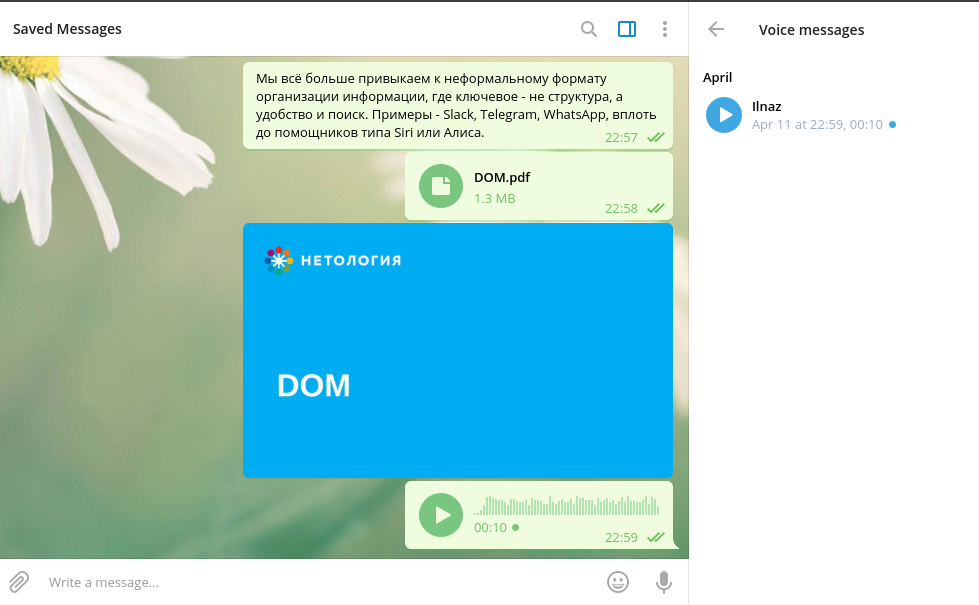
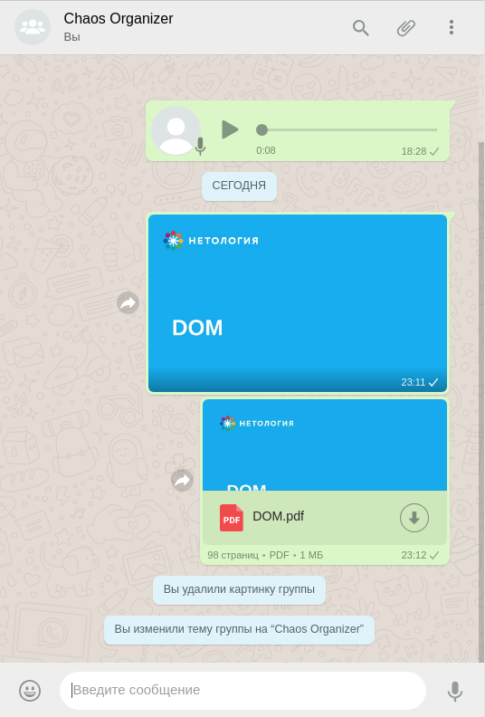
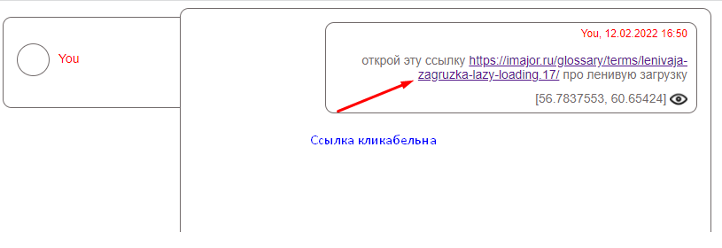
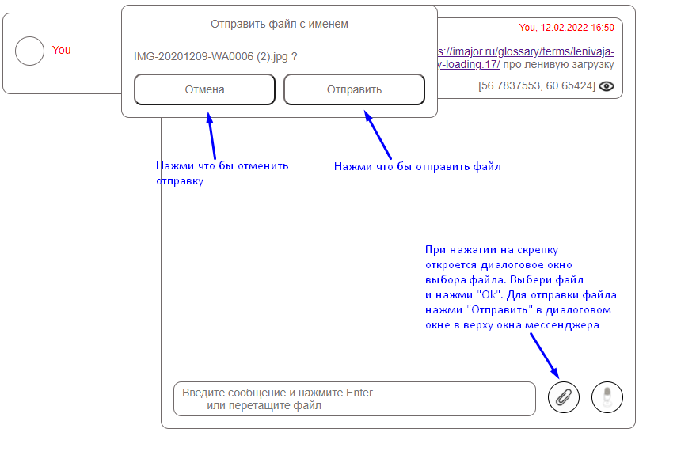
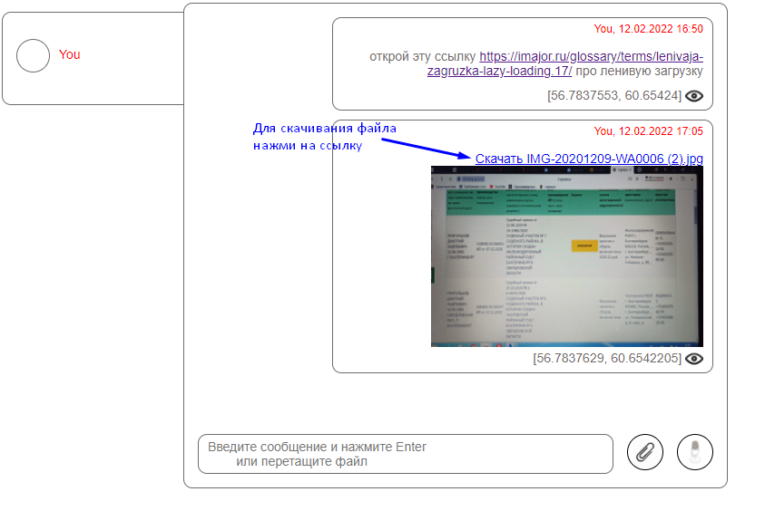
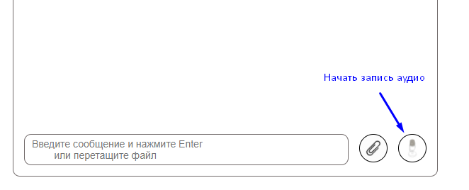
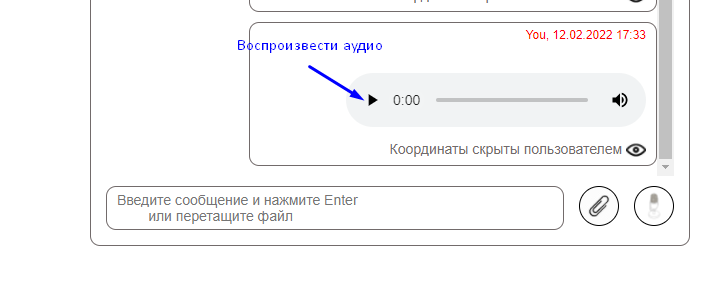

https://llstudent83.github.io/AHJ_diplom_messenger/

# Webpack5

[Информация о релизе Webpack 5](https://webpack.js.org/blog/2020-10-10-webpack-5-release/)

[Migration Guide](https://webpack.js.org/migrate/5/)

# Дипломное задание к курсу «Продвинутый JavaScript в браузере». Chaos Organizer

tags: netology advanced js in html
## Легенда
Мы всё больше привыкаем к неформальному формату организации информации, где ключевое - не структура, а удобство и поиск. Примеры - Slack, Telegram, WhatsApp, вплоть до помощников типа Siri или Алиса.

## Основная концепция
Ключевая идея - создать бота, который предназначен как для хранения информации, так и для поиска, и других сервисов: напоминания, уведомление и интеграция с внешними сервисами.

Назовём это глобальным ботом-органайзером - вы закидывате туда всю информацию, которая вам нужна, а он сортирует, обеспечивает поиск, хранение и напоминание.

## Прототипы
В качестве прототипов для реализации мы предлагаем вам взять функциональность Telegram, WhatsApp, Slack или подобных мессенджеров, только вместо живого собеседника у вас будет бот )).

Например, скриншот Telegram:

Или Whatsapp:

Или Slack:

## Анализ
Вам нужно провести самостоятельный анализ данных приложений (можете взять альтернативы, если не пользуетесь данными, например - Viber и т.д.), изучить их способы взаимодействия и на базе них продумать, как вы будете организовывать интерфейс, и, самое главное, какие функции в первую очередь реализовывать.

## Архитектура
Поскольку вы - автор системы и ключевой её архитектор, вам предстоит самостоятельно решить, какие технологии использовать (но Webpack, Babel, ESLint и Appveyor для развёртывания - обязательны) как на клиентской, так и на серверной стороне.

Обратите внимание, Heroku:

* будет останавливать ваше приложение (все данные, хранящиеся в памяти сотрутся)
* будет удалять все ваши файлы, которые не хранятся в Git (при остановке вашего приложения)
Поэтому несколько советов:

* чтобы каталог хранился в Git (и его не приходилось создавать средствами Node.js) поместите в каталог пустой файл .gitkeep
* захардкодьте часть демо-данных (файлы и данные в памяти), чтобы было удобно проверять и не приходилось каждый раз загружать файлы

По организации серверной части мы не требуем от вас ничего, сверх того, что проходили на лекциях (этого должно быть достаточно для реализации всех функций):

* koa (и компания)
* http-event-stream
* ws
Все данные на сервере для простоты храните в памяти в виде массива (или любого другого контейнера, который вам нравится - Set, Map).

Не думайте о проблемах, связанных с хранением данных в памяти сервера (о том, что там может храниться слишком много сообщений).

## Ключевые функции
Мы, конечно, немного схитрили и уже за вас продумали ряд функций, которые обязательно должно включать в себя приложение.

Все функции разбиты на две категории:

Обязательные
Дополнительные

Все функции из обязательных должны быть реализованы. Из дополнительных должно быть реализовано не менее 5, вы сами решаете какие 5 (можете и больше) это будут.

## Реализовано

1. Сохранение в истории ссылок и текстовых сообщений

    Все отправленные сообщения сохраняются на сервере.
    
2. Ссылки (то, что начинается с http:// или https://) должны быть кликабельны и отображаться как ссылки

3. Сохранение в истории изображений, видео и аудио (как файлов) - через Drag & Drop и через иконку загрузки (скрепка в большинстве мессенджеров)

    При перетаскивании файла из операционной системы ПК в область строки ввода текста срабатывает алкорими отправки файла аналогичный тому, что описан при добавлении файла через кнопку с изображением скрепки

4. Скачивание файлов (на компьютер пользователя)

5. Ленивая подгрузка: сначала подгружаются последние 10 сообщений, при прокрутке вверх подгружаются следующие 10 и т.д. (не реализована)

6. Синхронизация - если приложение открыто в нескольких окнах (вкладках), то контент должен быть синхронизирован

    При открытии мессенджера у нескльких польлзователей сообщения будут отображаться у всех подключенных пользователей
    
7. Запись аудио (используя API браузера)

    При нажатии на кнопку с изображением микрофона начнется запись аудио. При нажатии на кномку с изображением крестика запись прервется. При нажатии на кнопку с изображением галочки запись завершится и записанная информация отправится в мессенджер.
8. Отправка геолокации

    В мессенджере реализован механизм определения местоположения пользователя. При отправке первого сообщения будет выброшено предупреждение о запросе координат. В случае согласия пользователя координаты будут автоматически прикрепляться к каждому сообщению. При отказе пльзователя от автоматического определения координат будет выброшено всплывающее окно. Интерфейс окна предлогает ввести координаты пользователя в ручную или полностью отказаться от отображения координат. В случае ввода координат вручную введенные данные будут провалидированы.
    
    
    
9. Воспроизведение аудио (используя API браузера)

 
 
Воспроизведение аудио происходит стандартными средствами браузера

10. Работа в оффлайн-режиме (при это загруженные сообщения должны кэшироваться и быть доступными после обновления страницы) (не реализована)

# Требования к оформлению
## Визуальное оформление
Мы никак не ограничиваем вас с точки зрения визуального оформления, но помните, что хорошо бы, чтобы человек, уже знакомый с вышеописанными мессенджерами, без труда смог пользоваться вашим приложением.

## Техническое оформление
Всё должно быть оформлено в виде публичного репозитория на GitHub.

Для фронтенда обязательно: Webpack, Babel, ESLint и Appveyor для развёртывания.

Клиентская часть должна быть выложена на GitHub Pages (не забудьте разместить бейджик сборки и ссылку на развёрнутое приложение) либо вместе с серверной на Heroku.

## Документация
Обязательно должен быть файл README.md, в котором описано, какие функции вы реализовали и как ими пользоваться (в картинках).

Важно: если функция не описана, считается, что её нет.
